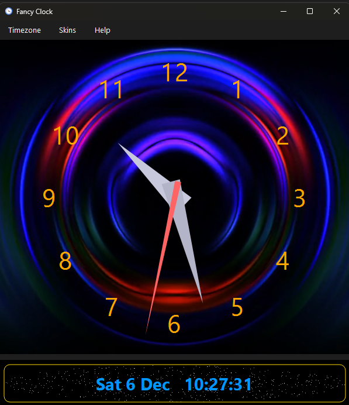

  

  

# Fancy Clock

## English
Fancy Clock is a cross‑platform desktop clock with analog and digital modes, automatic timezone localization, and multiple UI skins including Starfield.  
It is lightweight, clear, and designed to stay unobtrusive on any desktop.

## Mandarin Chinese (Simplified)
Fancy Clock 是跨平台桌面时钟，具有指针和数字模式、自动时区本地化，并提供包括星空效果在内的多种界面皮肤。  
它轻量、清晰，并设计为在桌面上保持低调。

## Mandarin Chinese (Traditional)
Fancy Clock 是跨平台桌面時鐘，具備指針與數位模式、自動時區本地化，以及包括星空效果在內的多種介面外觀。  
它輕量、清晰，並設計成在桌面上不造成干擾。

## Spanish
Fancy Clock es un reloj de escritorio multiplataforma con modos analógico y digital, localización automática de zona horaria y varias apariencias, incluida Starfield.  
Es ligero, claro y diseñado para mantenerse discreto en el escritorio.

## Hindi
Fancy Clock एक क्रॉस‑प्लेटफ़ॉर्म डेस्कटॉप घड़ी है जिसमें एनालॉग और डिजिटल मोड, स्वचालित समय‑क्षेत्र स्थानीयकरण और Starfield सहित कई स्किन शामिल हैं।  
यह हल्की, स्पष्ट है और डेस्कटॉप पर बिना बाधा के रहने के लिए बनाई गई है।

## Arabic
Fancy Clock هو تطبيق ساعة لسطح المكتب يعمل عبر الأنظمة، بوضعيه التناظري والرقمي، مع تحديد تلقائي للمنطقة الزمنية وواجهات متعددة تشمل Starfield.  
إنه خفيف وواضح ومصمم ليبقى غير ملحوظ على سطح المكتب.

## French
Fancy Clock est une horloge de bureau multiplateforme avec modes analogique et numérique, localisation automatique du fuseau horaire et plusieurs habillages dont Starfield.  
Elle est légère, lisible et conçue pour rester discrète sur le bureau.

## Bengali
Fancy Clock একটি ক্রস‑প্ল্যাটফর্ম ডেস্কটপ ঘড়ি, যেখানে অ্যানালগ ও ডিজিটাল মোড, স্বয়ংক্রিয় টাইমজোন লোকালাইজেশন এবং স্টারফিল্ডসহ বিভিন্ন স্কিন রয়েছে।  
এটি হালকা, পরিষ্কার এবং ডেস্কটপে অনাড়ম্বর থাকার জন্য ডিজাইন করা।

## Portuguese
Fancy Clock é um relógio de desktop multiplataforma com modos analógico e digital, localização automática do fuso horário e vários temas, incluindo Starfield.  
É leve, claro e concebido para permanecer discreto no ambiente de trabalho.

## Russian
Fancy Clock — кроссплатформенные настольные часы с аналоговым и цифровым режимами, автоматической локализацией часового пояса и различными оформлениями, включая Starfield.  
Они лёгкие, понятные и созданы для незаметной работы на рабочем столе.

## Japanese
Fancy Clock はクロスプラットフォーム対応のデスクトップ時計で、アナログとデジタル表示、自動タイムゾーン設定、Starfield を含む複数のスキンに対応しています。  
軽量で見やすく、デスクトップ上で邪魔にならないよう設計されています。

## German
Fancy Clock ist eine plattformübergreifende Desktop‑Uhr mit analogem und digitalem Modus, automatischer Zeitzonenlokalisierung und mehreren Skins wie Starfield.  
Sie ist leichtgewichtig, übersichtlich und für einen unaufdringlichen Desktop‑Einsatz ausgelegt.

## Javanese
Fancy Clock minangka jam desktop lintas‑platform kanthi mode analog lan digital, lokalisi otomatis zona wektu, lan macem‑macem kulit kalebu Starfield.  
Iki entheng, cetha, lan dirancang supaya tetep ora ngganggu ing desktop.

## Korean
Fancy Clock 는 아날로그 및 디지털 모드, 자동 시간대 설정, Starfield 를 포함한 여러 스킨을 지원하는 크로스 플랫폼 데스크톱 시계입니다.  
가볍고 명확하며 데스크톱에서 방해되지 않도록 설계되었습니다.

## Vietnamese
Fancy Clock là đồng hồ máy tính để bàn đa nền tảng với chế độ analog và kỹ thuật số, tự động nhận dạng múi giờ và nhiều giao diện như Starfield.  
Nó nhẹ, rõ ràng và được thiết kế để không gây vướng víu trên màn hình.

## Turkish
Fancy Clock, analog ve dijital modlara sahip, otomatik saat dilimi yerelleştirme ve Starfield dahil çeşitli görünümler sunan çok platformlu bir masaüstü saatidir.  
Hafiftir, nettir ve masaüstünde fark edilmeden çalışacak şekilde tasarlanmıştır.

## Italian
Fancy Clock è un orologio da desktop multipiattaforma con modalità analogica e digitale, localizzazione automatica del fuso orario e vari temi tra cui Starfield.  
È leggero, chiaro e progettato per rimanere discreto sul desktop.

## Polish
Fancy Clock to wieloplatformowy zegar pulpitowy z trybem analogowym i cyfrowym, automatyczną lokalizacją strefy czasowej oraz różnymi motywami, w tym Starfield.  
Jest lekki, przejrzysty i zaprojektowany tak, aby pozostać dyskretnym na pulpicie.

## Dutch
Fancy Clock is een cross‑platform bureaubladklok met analoge en digitale modi, automatische tijdzoneherkenning en diverse skins zoals Starfield.  
Hij is licht, overzichtelijk en ontworpen om onopvallend op het bureaublad te blijven.

## Thai
Fancy Clock เป็นนาฬิกาบนเดสก์ท็อปแบบข้ามแพลตฟอร์มที่มีโหมดอนาล็อกและดิจิทัล การระบุตำแหน่งโซนเวลาอัตโนมัติ และสกินหลายแบบรวมถึง Starfield  
มีความเบา ชัดเจน และออกแบบมาเพื่อไม่ให้รบกวนการใช้งานบนเดสก์ท็อป

## Swedish
Fancy Clock är en plattformsoberoende skrivbordsklocka med analoga och digitala lägen, automatisk tidszonlokalisering och flera utseenden som Starfield.  
Den är lätt, tydlig och utformad för att vara diskret på skrivbordet.

## Ukrainian
Fancy Clock — це кросплатформовий настільний годинник з аналоговим і цифровим режимами, автоматичною локалізацією часових поясів та кількома оформленнями, включно зі Starfield.  
Він легкий, зрозумілий і створений для непомітної роботи на робочому столі.

## Persian
Fancy Clock یک ساعت رومیزی چندسکویی با حالت‌های آنالوگ و دیجیتال، بومی‌سازی خودکار منطقه زمانی و چندین پوسته از جمله Starfield است.  
سبک، واضح و طوری طراحی شده است که روی دسکتاپ مزاحم نباشد.

## Romanian
Fancy Clock este un ceas de desktop multiplatformă cu moduri analogic și digital, localizare automată a fusului orar și mai multe teme precum Starfield.  
Este ușor, clar și proiectat pentru a rămâne discret pe desktop.

## Greek
Το Fancy Clock είναι ένα πολυπλατφορμικό ρολόι γραφείου με αναλογική και ψηφιακή λειτουργία, αυτόματη εντοπίση ζώνης ώρας και διάφορες εμφανίσεις όπως το Starfield.  
Είναι ελαφρύ, καθαρό και σχεδιασμένο να παραμένει διακριτικό στην επιφάνεια εργασίας.
