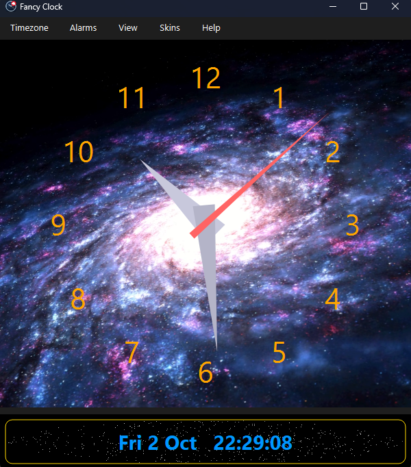
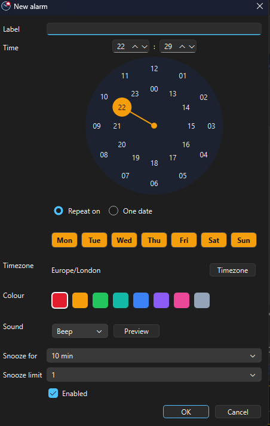
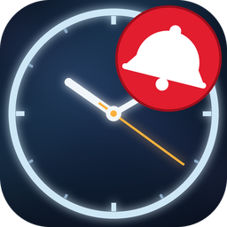

<p align="center">
  
</p>

<p align="center">
  
</p>

<p align="center">
  
</p>

# Fancy Clock

Fancy Clock is a cross-platform desktop clock: an analog dial with a digital date and time readout beneath it, automatic timezone localization, nine UI skins including Starfield, adjustable window opacity and full alarm support with snooze, colours and sounds. It is lightweight, clear and designed to stay unobtrusive on any desktop.

**Who it is for:** anyone who wants a calm clock in a window of its own on Windows, macOS or Linux, with correct local time wherever they are and alarms that behave like a phone's.

**Who it is not for:** anyone after a calendar, a timer or stopwatch, a widget platform or a scheduler that can wake a sleeping machine. Fancy Clock never wakes a suspended or powered-off computer; it reports what it missed instead.

Website: [ernster.dev/FancyClock](https://ernster.dev/FancyClock/)

> **Commercial licences available.** Fancy Clock is free and open source under LGPL-3.0. If those terms do not suit what you are building, a commercial licence can be bought from me separately. It covers my own code; PySide6 keeps its own LGPL-3.0 licence. See [commercial licensing](https://ernster.dev/commercial-licensing.html).

## What it does

- An analog dial and a digital readout together in one window, which can be dragged by its face; the skin, timezone, language and opacity are remembered between sessions.
- Automatic timezone localization: the system timezone drives the display; choosing a timezone moves the interface, numerals included, into that place's language when it is one of the supported locales. Timezones are listed by their IANA names (such as `Asia/Tokyo`), which are not translated.
- 36 languages across 40 regional locales, detected from the system on first launch and changed by choosing a timezone. Translation files for a further 200 or so locales ship with the app but cannot be selected yet; a zone whose language is one of those shows the closest supported locale or English.
- Nine skins: the procedural Starfield plus eight animated video backdrops.
- Adjustable window opacity from the View menu slider, Ctrl with the arrow keys or Ctrl with the mouse wheel (Windows and macOS; the Flatpak sandbox cannot set per-window opacity).
- Automatic NTP time correction at startup, so the display stays honest when the machine clock has drifted.
- Alarms, covered below.
- An update check that respects you: shortly after launch and once a day while running, the app asks GitHub anonymously whether a newer published release exists, with Help > Check for updates doing the same on demand. Download, Skip this version or Later; a skipped version never prompts again and a failed check stays silent.
- Local-first: no account, no telemetry and no cloud. Its only network calls are a single NTP query at startup (falling back to the system clock when no server answers) and the anonymous daily update check against GitHub releases.

## Alarms

- Weekly-repeating or one-off alarms with a clock-face time picker, per-alarm labels, colours and timezone.
- Five bundled sounds (Beep, Chime, Bell, Pulse, Marimba) with preview and a global volume.
- Snooze with per-alarm duration, an Android-style snooze budget (1, 3, 5 or unlimited per ring) and a re-pickable duration on every snooze.
- A persistent firing window plus a best-effort system notification; a missed-alarms summary covers anything that fired while the machine was asleep or the app was closed.
- System tray icon with next-alarm tooltip, master switch and close-to-tray; optional start at sign-in (installer checkbox on Windows, in-app toggle everywhere it is supported).
- Alarms fire on the same NTP-corrected time the clocks display and handle DST transitions correctly; import and export as JSON.
- A damaged alarms file is reported rather than quietly costing you an alarm. Unreadable entries are skipped so the app always starts; the count is shown once at startup, so an alarm that will not ring is something you are told about rather than something you discover by oversleeping. The damaged file is first copied aside untouched (the warning names the copy), so nothing in it is lost to the next save.
- Honest limits: a suspended or powered-off machine is never woken; missed alarms are reported on the next launch or wake instead.

## Downloads

| Platform | Package | Notes |
|---|---|---|
| Windows | `FancyClockSetup.exe` | Setup wizard; per-user install, no admin; uninstall from Settings > Apps |
| macOS | `FancyClock.dmg` | Open and drag Fancy Clock to Applications |
| Linux | `FancyClock.flatpak` | `flatpak install FancyClock.flatpak` |

All packages are on the [releases page](https://github.com/oernster/FancyClock/releases).

## Stack

| Layer | Choice |
|---|---|
| Language | Python 3.11 or newer |
| UI toolkit | PySide6 (Qt 6), including QtMultimedia for the video skins |
| Time data | `pytz` for the timezone catalog, `zoneinfo` with `tzdata` for alarm fold semantics, `tzlocal` for system detection |
| Time source | NTP over UDP, with the system clock as the fallback |
| Storage | JSON under the per-user config directory for settings and alarms |
| Localisation | Bespoke JSON locale store under `localization/translations/` |
| Tests | `pytest` with `pytest-cov`, hand-written fakes and no mock libraries |
| Quality | `black`, `flake8`, `ruff` and structural architecture tests |
| Packaging | PyInstaller plus a bespoke installer (Windows), create-dmg (macOS), Flatpak (Linux) |
| Media | Git LFS for the `media/*.mp4` skins |

## Install and run from source

The video skins live in Git LFS, so install LFS before cloning or the `.mp4` files arrive as pointer stubs.

```bash
git lfs install
git clone https://github.com/oernster/FancyClock.git
cd FancyClock
git lfs checkout

python -m venv venv
source venv/bin/activate          # Windows PowerShell: venv\Scripts\Activate.ps1
pip install -r requirements.txt -r requirements-dev.txt

python main.py
```

## Test

```bash
python -m pytest
```

The suite runs unit, integration and structural tests behind a hard 100% line and branch coverage gate over the `fancyclock` package (less its interface) and the setup program's Qt-free half. `black --check .`, `flake8 .` and `ruff check .` are standing steps alongside it. [`TESTING.md`](TESTING.md) says what sits outside the gate (the setup program's Qt client among it) and how a test is written. Ruff selects `BLE`, so a blind `except Exception` fails the lint everywhere in the tree, the setup program included.

## Build

| Target | Command | Output |
|---|---|---|
| Windows installer | `python buildexe.py` then `python buildinstaller.py` | `dist-installer/FancyClockSetup.exe` |
| macOS DMG | `python builddmg.py` | `FancyClock.dmg` |
| Linux Flatpak | `./build_flatpak.sh` | `FancyClock.flatpak` in the repository root |
| Icon assets | `python generate_icons.py` | badged `fancyclock.png` plus the full `assets/` set from the `fancyclock_plain.png` master |
| Alarm sounds | `python generate_sounds.py` | `assets/sounds/`, synthesised deterministically |

Prerequisites, troubleshooting and the Flatpak `vendor/` wheel cache are in [`DEVELOPMENT.md`](DEVELOPMENT.md). The build script fills that cache for you; pass `--no-fetch` to demand a pre-populated one for an air-gapped build.

## Development

The codebase follows a clean-architecture layout: `fancyclock/{domain,application,infrastructure,ui}` with an explicit composition root and structural tests enforcing the boundaries. See [`ARCHITECTURE.md`](ARCHITECTURE.md). [`TECH_DEBT.md`](TECH_DEBT.md) records what is still open, what is deliberately left and what only looks like debt. [`DECISIONS-TRADEOFFS.md`](DECISIONS-TRADEOFFS.md) sets out the decisions Fancy Clock rests on, with what each one gains and what it costs.

## English
Fancy Clock is a cross-platform desktop clock with an analog dial and a digital readout, automatic timezone localization and multiple UI skins including Starfield.  
It is lightweight, clear and designed to stay unobtrusive on any desktop.

## Mandarin Chinese (Simplified)
Fancy Clock 是跨平台桌面时钟，具有指针表盘和数字读数、自动时区本地化，并提供包括星空效果在内的多种界面皮肤。  
它轻量、清晰，并设计为在桌面上保持低调。  

## Mandarin Chinese (Traditional)
Fancy Clock 是跨平台桌面時鐘，具備指針錶盤與數位讀數、自動時區本地化，以及包括星空效果在內的多種介面外觀。  
它輕量、清晰，並設計成在桌面上不造成干擾。  

## Spanish
Fancy Clock es un reloj de escritorio multiplataforma con una esfera analógica y una lectura digital, localización automática de zona horaria y varias apariencias, incluida Starfield.  
Es ligero, claro y diseñado para mantenerse discreto en el escritorio.  

## Hindi
Fancy Clock एक क्रॉस‑प्लेटफ़ॉर्म डेस्कटॉप घड़ी है जिसमें एनालॉग डायल और डिजिटल रीडआउट, स्वचालित समय‑क्षेत्र स्थानीयकरण और Starfield सहित कई स्किन शामिल हैं।  
यह हल्की, स्पष्ट है और डेस्कटॉप पर बिना बाधा के रहने के लिए बनाई गई है।  

## Arabic
Fancy Clock هو تطبيق ساعة لسطح المكتب يعمل عبر الأنظمة، بقرص تناظري وقراءة رقمية، مع تحديد تلقائي للمنطقة الزمنية وواجهات متعددة تشمل Starfield.  
إنه خفيف وواضح ومصمم ليبقى غير ملحوظ على سطح المكتب.  

## French
Fancy Clock est une horloge de bureau multiplateforme avec un cadran analogique et un affichage numérique, localisation automatique du fuseau horaire et plusieurs habillages dont Starfield.  
Elle est légère, lisible et conçue pour rester discrète sur le bureau.  

## Bengali
Fancy Clock একটি ক্রস‑প্ল্যাটফর্ম ডেস্কটপ ঘড়ি, যেখানে অ্যানালগ ডায়াল ও ডিজিটাল রিডআউট, স্বয়ংক্রিয় টাইমজোন লোকালাইজেশন এবং স্টারফিল্ডসহ বিভিন্ন স্কিন রয়েছে।  
এটি হালকা, পরিষ্কার এবং ডেস্কটপে অনাড়ম্বর থাকার জন্য ডিজাইন করা।  

## Portuguese
Fancy Clock é um relógio de desktop multiplataforma com um mostrador analógico e uma leitura digital, localização automática do fuso horário e vários temas, incluindo Starfield.  
É leve, claro e concebido para permanecer discreto no ambiente de trabalho.  

## Russian
Fancy Clock: кроссплатформенные настольные часы с аналоговым циферблатом и цифровым табло, автоматической локализацией часового пояса и различными оформлениями, включая Starfield.  
Они лёгкие, понятные и созданы для незаметной работы на рабочем столе.  

## Japanese
Fancy Clock はクロスプラットフォーム対応のデスクトップ時計で、アナログ文字盤とデジタル表示、自動タイムゾーン設定、Starfield を含む複数のスキンに対応しています。  
軽量で見やすく、デスクトップ上で邪魔にならないよう設計されています。  

## German
Fancy Clock ist eine plattformübergreifende Desktop‑Uhr mit analogem Zifferblatt und digitaler Anzeige, automatischer Zeitzonenlokalisierung und mehreren Skins wie Starfield.  
Sie ist leichtgewichtig, übersichtlich und für einen unaufdringlichen Desktop‑Einsatz ausgelegt.  

## Javanese
Fancy Clock minangka jam desktop lintas‑platform kanthi rai jam analog lan tampilan digital, lokalisi otomatis zona wektu, lan macem‑macem kulit kalebu Starfield.  
Iki entheng, cetha, lan dirancang supaya tetep ora ngganggu ing desktop.  

## Korean
Fancy Clock 는 아날로그 다이얼 및 디지털 표시, 자동 시간대 설정, Starfield 를 포함한 여러 스킨을 지원하는 크로스 플랫폼 데스크톱 시계입니다.  
가볍고 명확하며 데스크톱에서 방해되지 않도록 설계되었습니다.  

## Vietnamese
Fancy Clock là đồng hồ máy tính để bàn đa nền tảng với mặt số analog và màn hình số, tự động nhận dạng múi giờ và nhiều giao diện như Starfield.  
Nó nhẹ, rõ ràng và được thiết kế để không gây vướng víu trên màn hình.  

## Turkish
Fancy Clock, analog kadran ve dijital göstergeye sahip, otomatik saat dilimi yerelleştirme ve Starfield dahil çeşitli görünümler sunan çok platformlu bir masaüstü saatidir.  
Hafiftir, nettir ve masaüstünde fark edilmeden çalışacak şekilde tasarlanmıştır.  

## Italian
Fancy Clock è un orologio da desktop multipiattaforma con un quadrante analogico e un display digitale, localizzazione automatica del fuso orario e vari temi tra cui Starfield.  
È leggero, chiaro e progettato per rimanere discreto sul desktop.  

## Polish
Fancy Clock to wieloplatformowy zegar pulpitowy z tarczą analogową i wyświetlaczem cyfrowym, automatyczną lokalizacją strefy czasowej oraz różnymi motywami, w tym Starfield.  
Jest lekki, przejrzysty i zaprojektowany tak, aby pozostać dyskretnym na pulpicie.  

## Dutch
Fancy Clock is een cross‑platform bureaubladklok met een analoge wijzerplaat en een digitale weergave, automatische tijdzoneherkenning en diverse skins zoals Starfield.  
Hij is licht, overzichtelijk en ontworpen om onopvallend op het bureaublad te blijven.  

## Thai
Fancy Clock เป็นนาฬิกาบนเดสก์ท็อปแบบข้ามแพลตฟอร์มที่มีหน้าปัดอนาล็อกและการแสดงผลดิจิทัล การระบุตำแหน่งโซนเวลาอัตโนมัติ และสกินหลายแบบรวมถึง Starfield  
มีความเบา ชัดเจน และออกแบบมาเพื่อไม่ให้รบกวนการใช้งานบนเดสก์ท็อป  

## Swedish
Fancy Clock är en plattformsoberoende skrivbordsklocka med en analog urtavla och en digital visning, automatisk tidszonlokalisering och flera utseenden som Starfield.  
Den är lätt, tydlig och utformad för att vara diskret på skrivbordet.  

## Ukrainian
Fancy Clock: це кросплатформовий настільний годинник з аналоговим циферблатом і цифровим табло, автоматичною локалізацією часових поясів та кількома оформленнями, включно зі Starfield.  
Він легкий, зрозумілий і створений для непомітної роботи на робочому столі.  

## Persian
Fancy Clock یک ساعت رومیزی چندسکویی با صفحهٔ عقربه‌ای آنالوگ و نمایشگر دیجیتال، بومی‌سازی خودکار منطقه زمانی و چندین پوسته از جمله Starfield است.  
سبک، واضح و طوری طراحی شده است که روی دسکتاپ مزاحم نباشد.  

## Romanian
Fancy Clock este un ceas de desktop multiplatformă cu un cadran analogic și un afișaj digital, localizare automată a fusului orar și mai multe teme precum Starfield.  
Este ușor, clar și proiectat pentru a rămâne discret pe desktop.  

## Greek
Το Fancy Clock είναι ένα πολυπλατφορμικό ρολόι γραφείου με αναλογικό καντράν και ψηφιακή ένδειξη, αυτόματη εντοπίση ζώνης ώρας και διάφορες εμφανίσεις όπως το Starfield.  
Είναι ελαφρύ, καθαρό και σχεδιασμένο να παραμένει διακριτικό στην επιφάνεια εργασίας.  

## Supporting the project

Fancy Clock is free and stays free. There is no paid tier, no licence key and no feature held back behind a donation. If you like it, a donation supports its maintenance and continued development.

<a href="https://www.paypal.com/ncp/payment/M7XJUDDW6MMA8"></a>

## Licence

GNU Lesser General Public License v3.0 only. The full text is in [`LICENSE`](LICENSE).

A commercial licence for my own code is also available, separately from the open-source licence: see [commercial licensing](https://ernster.dev/commercial-licensing.html).
